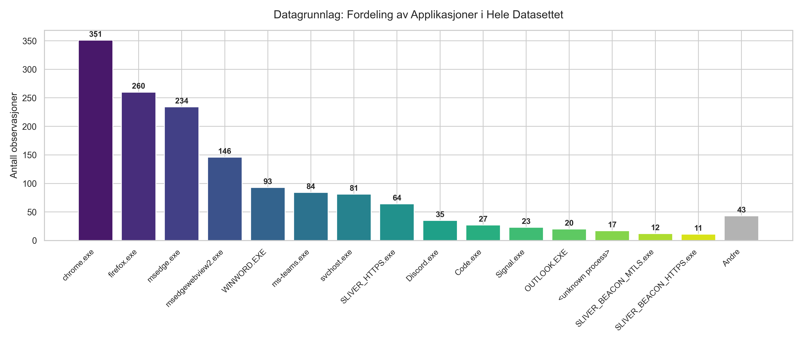
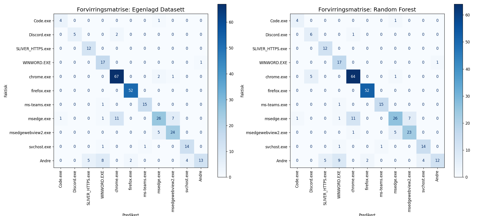
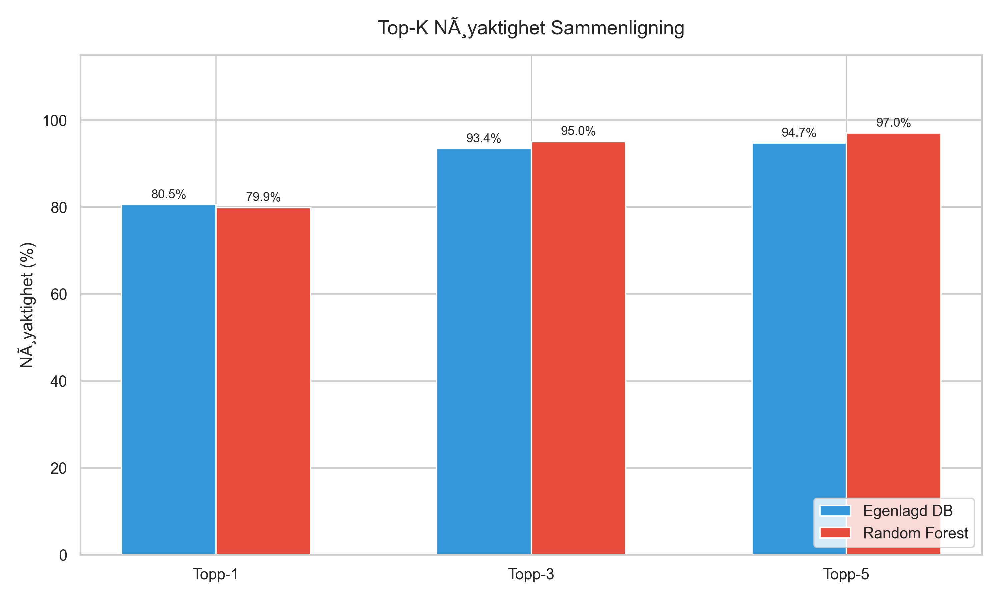
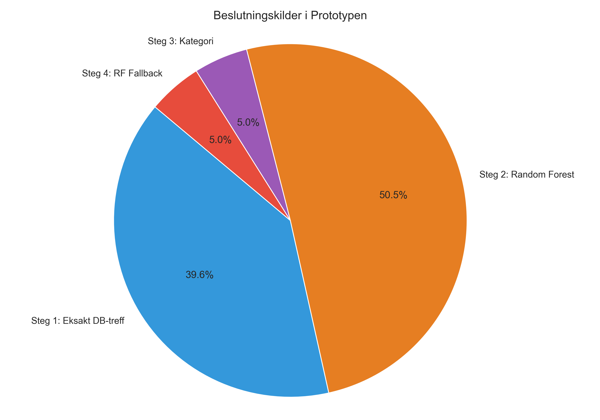
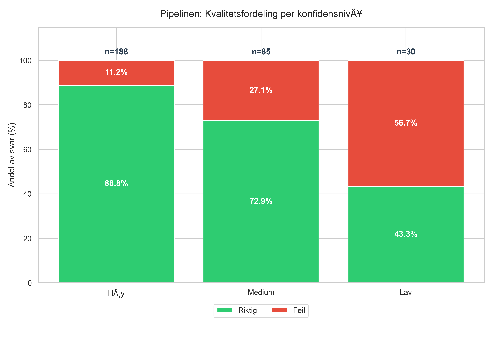

# Bachelor Thesis Results

This document presents the finalized evaluation results of the JA4+ fingerprinting pipeline, structured exactly as requested.

## Application Distribution

The graph below visualizes the distribution of applications within our dataset.

## FoxIO Database Search Statistics

The following table summarizes the evaluation of the public FoxIO JA4+ database against our test dataset, explicitly comparing the performance of the JA4 and JA4S fingerprints.

| Fingeravtrykk | Ingen Treff | Kollisjon | Unik match |
|---------------|-------------|-----------|------------|
| **JA4**       | 13.2 %      | 86.8 %    | 0 %        |
| **JA4S**      | 83.8 %      | 0 %       | 16.2 %     |

## Classifier Performance: Confusion Matrices

The image below compares the prediction accuracy of the **Egenlagd Datasett** vs the **Random Forest** model using confusion matrices. It displays the 10 most common applications, grouping all remaining applications into the "Other" category.

## Top-K Accuracy Comparison

This graph illustrates the Top-1, Top-3, and Top-5 accuracy across the evaluated models.

## Unified Pipeline Analytics

### Pipeline Sources
This graph shows the origin of the final decision within the Unified Pipeline.

### Pipeline Confidence
This graph outlines the distribution of the reported confidence levels when the Unified Pipeline outputs a prediction.

